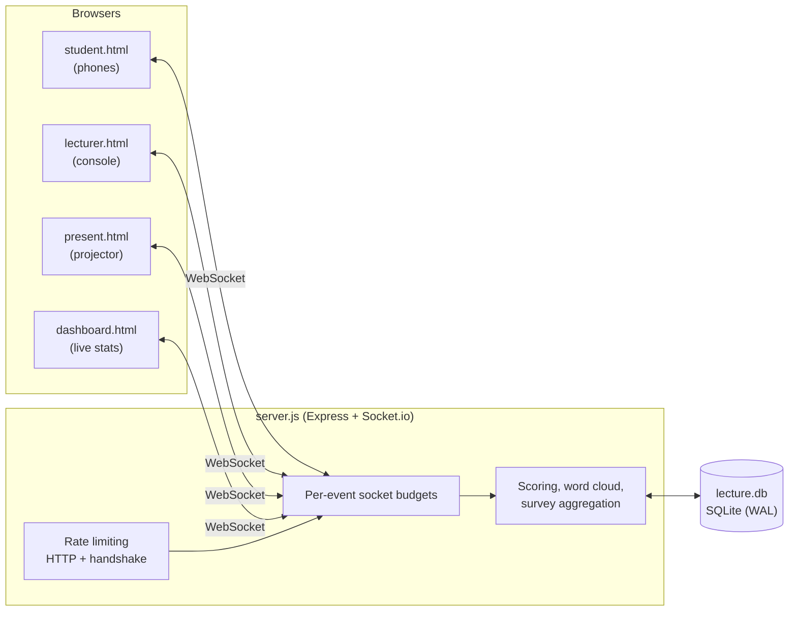

# UTP Adjunct Lecture — Interactive Lecture System

A real-time, phone-friendly lecture app for the UTP Adjunct Lecture
**"Descriptive Statistics in Practice: Industry Insights and Responsible AI"**.

Students join from their phones, answer quizzes and surveys, send short feedback
and questions, and earn points for their team. The lecturer drives slides from a
console; a projector view and a live dashboard follow along. Everything syncs
over Socket.io and persists to a local SQLite file.

---

## Features

- **Live slide sync** — lecturer console and present mode stay in lockstep;
  students receive slides only while the session is active.
- **Quiz rounds** — multiple-choice questions with a built-in question bank
  seeded per slide/checkpoint. Non-responders drop off the active roster.
- **Surveys & polls** — reusable prompt bank, rendered on a 5-point agree scale,
  aggregated with per-option tallies and a mean.
- **Feedback word cloud** — short feedback (≤3 words) plus a star rating, cleaned
  server-side and aggregated into a live word cloud.
- **Team scoring** — each student's score is their own points **plus** a team
  bonus derived from their team's *average*, so rallying idle teammates pays off.
- **Live dashboard** — group leaderboard, score histogram, active roster,
  response counts, survey results, and word cloud.
- **Anti-abuse by design** — layered HTTP, Socket.io and per-action rate limits
  (see [Rate limiting & anti-spam](#rate-limiting--anti-spam)).

---

## Architecture



The whole backend is a single file, [`server.js`](server.js): Express serves the
static pages from `public/`, Socket.io carries all realtime traffic, and
`better-sqlite3` stores state synchronously. There is no build step — the
browser files are plain HTML/CSS/JS loaded as-is.

---

## Quick start

Requires Node.js 18+ (20 recommended).

```bash
npm install
npm start          # http://localhost:3000
```

Development mode with auto-restart:

```bash
npm run dev        # node --watch server.js
```

Then open:

| Page | URL | Purpose |
| --- | --- | --- |
| Landing | `/` | Links to every mode |
| Student | `/student.html` | Join, answer, earn points (share this with the room) |
| Lecturer | `/lecturer.html` | Slide control, quizzes, surveys, Q&A (password-locked) |
| Present | `/present.html` | Full-screen slide view for the projector |
| Dashboard | `/dashboard.html` | Live leaderboard and stats |

The landing page shows the LAN host so students can type the URL directly.
For a room-wide session, use **Present mode** so the join QR encodes a reachable
address (see [Deployment](#deployment)).

### Environment variables

| Variable | Default | Purpose |
| --- | --- | --- |
| `PORT` | `3000` | HTTP port |
| `DB_PATH` | `lecture.db` | SQLite file path (Docker uses `/data/lecture.db`) |
| `ADMIN_PASSWORD` | *(unset)* | Locks `/lecturer.html`; unset = auth disabled |

The rate-limit and point-rule variables are documented in
[deploy/README.md](deploy/README.md#rate-limiting).

---

## Project structure

```
server.js                     Express + Socket.io + SQLite: all server logic
package.json                  Scripts and dependencies
lecture.db                    SQLite database (git-ignored, created on first run)

public/                       Static front end, served at the root
  landing.html                  Entry point linking every mode
  student.html                  Student UI
  lecturer.html                 Lecturer console (slide + quiz/survey control)
  present.html                  Projector view
  dashboard.html                Live dashboard
  css/style.css                 All styling
  js/
    slides.js                   23 slide definitions, shared by lecturer + present
    student.js                  Student socket logic and UI
    lecturer.js                 Console socket logic and UI
    present.js                  Presenter socket logic
    dashboard.js                Dashboard socket logic
    rate-limit-client.js        Client-side throttles/debounce around socket.emit
    toast.js                    Notification helper
    qrcode.js                   Vendored QR generator (for the join code)

scripts/
  simulate-students.js        Load test: N simulated students joining and acting
  test-rate-limit.js          Boots the real server and asserts each limit engages

deploy/                       Docker + DigitalOcean deployment (see its README)
```

---

## Data model

All tables are created on first boot in [`server.js`](server.js) via
`CREATE TABLE IF NOT EXISTS`.

| Table | Holds |
| --- | --- |
| `students` | One row per student: name and assigned `group_id` |
| `responses` | Every submission — `type` is `quiz`, `survey`, `feedback` or `question`, with points and timestamp |
| `groups` | Teams; seeded with eight statistics-themed teams (Team Mean, Team Median, …) |
| `question_bank` | Reusable multiple-choice questions, grouped by slide/checkpoint |
| `survey_bank` | Reusable survey/poll prompts |
| `surveys` | One row per survey **actually sent** (wording + options), so the dashboard can label the answers |
| `settings` | Key/value store — admin password and seed version flags (`qb_version`, `sb_version`) |

Seeded content is versioned (`QB_VERSION`, `SB_VERSION`): bump the constant and
the default question/survey banks are replaced on next boot.

**Student grouping** is round-robin by signup order, so a new student is
assigned to `groups[studentCount % groups.length]`.

---

## Realtime event reference

All traffic is Socket.io. Handlers live in the `io.on('connection')` block of
[`server.js`](server.js).

### Student → server

| Event | Payload | Notes |
| --- | --- | --- |
| `student:login` | `{ name }` | Creates the student, or re-attaches the socket on refresh |
| `student:logout` | — | Leaves the session and drops off the roster |
| `student:requestSlide` | — | Re-requests the current slide |
| `student:quiz` | `{ questionId, answer, points }` | Awards points; marks the student active |
| `student:survey` | `{ surveyId, questionId, answer }` | Records one survey vote |
| `student:feedback` | `{ text, rating }` | Trimmed to 3 words, worth 5 points |
| `student:question` | `{ text }` | 10–200 chars, worth 3 points; pushed to the lecturer Q&A panel |
| `dashboard:request` | — | Polls for stats (slim payload for students) |

### Lecturer / presenter → server

| Event | Payload | Notes |
| --- | --- | --- |
| `lecturer:login` | `{ password }` | Only enforced when `admin_password` is set |
| `controller:join` | — | Joins the `controllers` room and receives the current state |
| `lecturer:slide` | `{ slide, title, content }` | Clamped server-side to `SLIDE_COUNT - 1`, broadcast to controllers and (if active) students |
| `lecturer:start` / `lecturer:stop` | — | Toggles `sessionActive`; students only receive slides while active |
| `lecturer:reset` | — | Wipes responses, students, quotas and active roster; resets to slide 0 |
| `lecturer:sendquiz` | quiz object | Broadcasts an ad-hoc quiz and starts the answer watch |
| `lecturer:bank:list` / `:add` / `:send` | `{ slideId, … }` | Manage and fire questions from the bank |
| `lecturer:sendsurvey` | `{ question, options }` | Stores the survey then broadcasts it |
| `lecturer:surveybank:list` | — | Lists reusable prompts |

### Server → clients

| Event | Audience | Meaning |
| --- | --- | --- |
| `student:loggedin` | Student | Login confirmed, with current slide + session state |
| `slide:change` | Controllers, students | New slide `{ slide, title, content }` |
| `session:status` / `session:reset` | Everyone | Session started/stopped/reset |
| `student:quiz:new` / `student:survey:new` | Students | A new quiz/survey to answer |
| `dashboard:data` | Requester | Stats payload (slim for students, full for dashboard/lecturer) |
| `lecturer:update`, `lecturer:question`, `lecturer:questions:backfill` | Lecturers | Roster changes and the Q&A feed |
| `rate:limited` | Offender | Friendly "slow down" toast |

---

## Scoring

A student's displayed total is:

$$
\text{total} = \underbrace{\sum \text{earned points}}_{\text{their own actions}} + \underbrace{\left\lfloor \overline{\text{team points}} \times 0.5 \right\rfloor}_{\text{team bonus}}
$$

- Points are awarded per action: quiz answers (by `points`), feedback (5),
  questions (3).
- The bonus uses the team **average** over all members (including those who have
  not scored), not the total — so being on a big team isn't a free win, and an
  idle teammate drags the figure down, giving everyone a reason to rally them.
- Only **active** students count (live socket, not dropped for a missed quiz),
  so closed browsers don't skew team averages.

### Active-roster rules

- A student is active from login and stays active while they participate.
- When a quiz is sent, a `QUIZ_RESPONSE_MS` (60s) watch starts; anyone present at
  send time who doesn't answer within the window is marked inactive. Students who
  join *after* the quiz was sent are not penalised.
- Closing the tab removes that socket; a student with no sockets left drops off
  the roster.

---

## Rate limiting & anti-spam

A lecture hall is ~200–300 phones on one server, and the app awards points per
action, so four independent layers keep one enthusiastic student (or a script)
from taking the lecture down or farming the scoreboard:

1. **HTTP** — `express-rate-limit` guards state-changing requests and new
   Socket.io handshakes, keyed by client IP. Static `GET`/`HEAD` are never
   limited, so a whole hall loading the page at once is harmless.
2. **Socket events** — messages never pass through Express, so every event gets
   its own token budget checked at three scopes:
   - *per socket* (one tab),
   - *per student* (shared across their tabs, so opening more tabs doesn't help),
   - *per IP* (backstop for an entire room behind one NAT/tunnel address).
   Over-limit senders get a `rate:limited` toast and are disconnected after
   repeated violations — the client auto-reconnects and auto-logs-in.
3. **Point rules** — feedback and questions have a per-action cooldown
   (`ACTIVITY_COOLDOWN_MS`) and a per-session cap (`FEEDBACK_CAP`,
   `QUESTION_CAP`). Enforced server-side, so a held-down button cannot inflate a
   score or the team bonus derived from it.
4. **Client-side throttles** — `public/js/rate-limit-client.js` spaces out
   `socket.emit` calls and debounces bursty polls, so a double tap or stuck key
   never becomes traffic in the first place.

Every limit is environment-configurable; set `RATE_LIMIT_ENABLED=0` to disable
limiting entirely. The full variable table lives in
[deploy/README.md](deploy/README.md#rate-limiting).

---

## Scripts

| Command | What it does |
| --- | --- |
| `npm start` | Run the server |
| `npm run dev` | Run with `node --watch` |
| `npm run simulate` | Spin up N simulated students that join, answer, vote and ask |
| `npm run test:rate-limit` | Boot the real server and assert every limit engages |

Load test options:

```bash
node scripts/simulate-students.js --students=200 --url=http://localhost:3000
node scripts/simulate-students.js --students=200 --duration=60 --burst
```

Useful for watching the dashboard fill up and for spotting performance problems
under realistic load.

After changing any rate limit or point rule, verify behaviour with:

```bash
npm run test:rate-limit
```

---

## Deployment

See [deploy/README.md](deploy/README.md) for the shared Docker setup and
[deploy/README-DIGITALOCEAN.md](deploy/README-DIGITALOCEAN.md) for the
recommended DigitalOcean path. In short:

```bat
cd deploy
do-deploy.bat            REM create droplet, push code, start app
do-sync.bat              REM push code changes (no rebuild)
do-sync.bat --restart    REM push + force docker rebuild
do-destroy.bat           REM delete droplet + DO SSH key
```

The container runs the app on port 3000, publishes it on port 80, mounts SQLite
on a persistent volume at `/data`, and starts a **Cloudflare Tunnel** container
alongside it so students get a real HTTPS URL without owning a domain. Open
Present mode at the printed HTTPS URL so the join QR encodes an address the
phones can actually reach.
